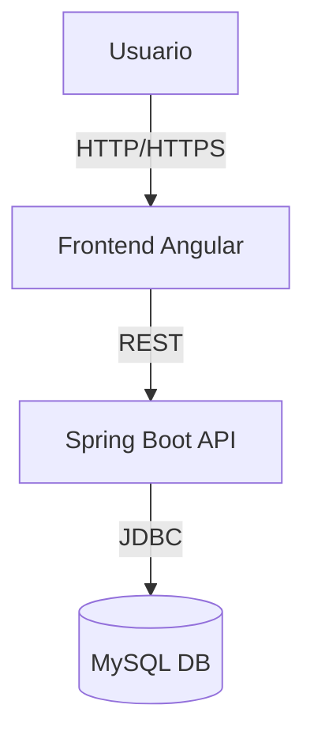
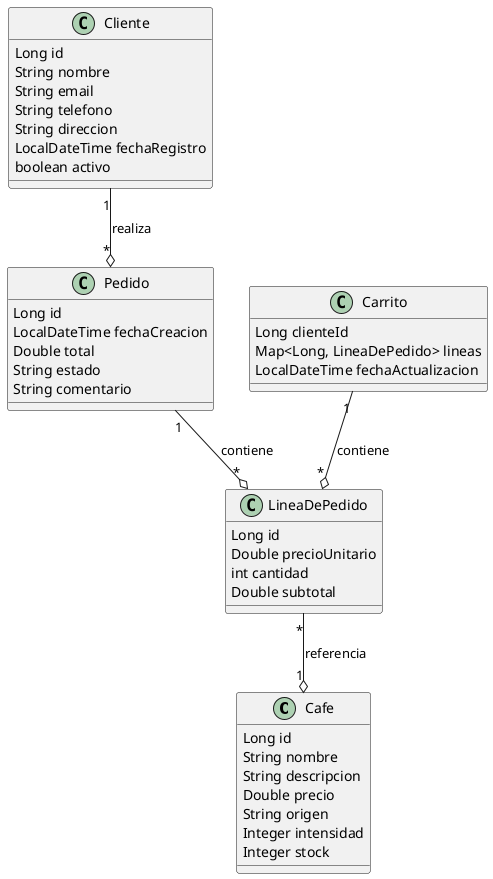

# 🏗️ Arquitectura y estructura del backend

Este documento describe la arquitectura, el flujo de datos y las mejores prácticas del proyecto TFC_CafeDeAltura.

---

## ✨ Mejoras implementadas respecto a lo exigido

| Mejora implementada                | Descripción breve                                                                 |
|------------------------------------|----------------------------------------------------------------------------------|
| Seguridad JWT y roles              | Endpoints protegidos y autenticación moderna, roles ADMIN/USER configurables      |
| Gestión de errores profesional     | Respuestas estructuradas y centralizadas en `GlobalExceptionHandler`             |
| Paginación avanzada                | Metadatos completos y ejemplos claros en la API y la documentación               |
| Documentación visual y profesional | Diagramas, tablas, ejemplos y enlaces cruzados                                   |
| Colección Postman avanzada         | Incluye tests automáticos y negativos ([docs/postman/README_Postman.md](../postman/README_Postman.md)) |
| Cobertura de código                | JaCoCo integrado y documentado                                                   |
| Scripts SQL robustos               | Incluyen índices, claves foráneas y datos de ejemplo                             |
| Guía de despliegue y configuración | Explicaciones para entornos de desarrollo y producción                            |
| Firma profesional y canales de contacto | Información de contacto y autoría en toda la documentación                  |
| Frontend visual integrado          | Paginación visual en la web, gestión de carrito, vistas Thymeleaf                |

---

## ⚠️ Advertencias y buenas prácticas

> ⚠️ **Advertencia:** Las credenciales mostradas en los ejemplos de configuración de base de datos son solo para desarrollo local. **Nunca uses estas credenciales en producción.** Define siempre tus propias variables de entorno seguras.

- Todas las validaciones de entrada **se realizan manualmente en los servicios**, siguiendo el enunciado del proyecto. Puede haber anotaciones automáticas (`@Valid`, `@NotNull`, etc.) en algunos DTOs o controladores para validaciones básicas, pero **la lógica principal de validación y la gestión de errores se implementa manualmente en la capa de servicios**.
- Se asegura la integridad de los datos recibidos y se gestionan los errores de forma centralizada, devolviendo respuestas estructuradas y mensajes claros.

---

## 🧱 Capas principales

| Capa         | Responsabilidad principal                                   |
|--------------|------------------------------------------------------------|
| Controlador  | Gestiona las peticiones HTTP y las respuestas              |
| Servicio     | Lógica de negocio y validaciones                           |
| Repositorio  | Acceso y gestión de datos (memoria/MySQL)                  |
| Entidad      | Modelos de datos (POJOs)                                   |
| Utilidad     | Utilidades y validadores personalizados                    |
| Excepciones  | Gestión centralizada de errores                            |

---

## 🛡️ Validaciones y gestión de errores

- Ejemplo de validación manual en servicios:

```java
// En CafeService.java
public Cafe crearCafe(Cafe cafe) {
    if (cafe.getNombre() == null || cafe.getNombre().isBlank()) {
        throw new BadRequestException("El nombre del café es obligatorio");
    }
    if (cafe.getPrecio() == null || cafe.getPrecio() <= 0) {
        throw new BadRequestException("El precio debe ser mayor que cero");
    }
    // ... resto de validaciones y lógica
    return cafeRepository.guardar(cafe);
}
```

- Ejemplo de respuesta de error estructurada:

```json
{
  "timestamp": "2024-06-01T12:34:56.789+00:00",
  "status": 400,
  "error": "Bad Request",
  "message": "El nombre del café es obligatorio",
  "path": "/api/cafe"
}
```

---

## 🔄 Paginación en la API y la web

- Todos los endpoints de tipo `GET all` soportan paginación mediante los parámetros de query `page` (número de página, empezando en 1) y `size` (tamaño de página).
- Ejemplo visual en la web:

```
<< < Página 2 de 5 > >>
```

El usuario puede navegar entre páginas haciendo clic en los enlaces "Anterior", "Siguiente" o en los números de página. Solo se muestran los elementos de la página actual, mejorando la experiencia y el rendimiento.

---

## ⚙️ Perfiles de Spring

- **dev/mem:** Almacenamiento en memoria, ideal para desarrollo y pruebas.
- **jpa/prod:** Persistencia en MySQL, recomendado para producción.
- Configura el perfil en `application.properties`:

  ```properties
  spring.profiles.active=mem # o jpa
  ```

---

## 🔐 Seguridad y roles

- El sistema implementa autenticación JWT y roles (`ADMIN`, `USER`).
- **Situación actual:** La lógica de generación y validación de tokens JWT está implementada y los endpoints críticos están protegidos por roles. Sin embargo, el filtro JWT no está conectado explícitamente a la cadena de filtros de Spring Security, por lo que la autenticación JWT puede no estar funcionando al 100% en todas las rutas protegidas. Además, el frontend Thymeleaf no está protegido por JWT, solo la API REST.
- **Advertencia:** Para un entorno profesional, es necesario añadir el filtro JWT a la configuración de seguridad y revisar la protección de rutas web si se requiere.
- Ejemplo de autenticación JWT:

```bash
curl -X POST http://localhost:8080/api/auth/login \
  -H "Content-Type: application/json" \
  -d '{"username": "admin", "password": "admin"}'
```

Respuesta:

```json
{"token": "eyJhbGciOiJIUzI1NiIsInR5cCI6..."}
```

Usa el token en tus peticiones:

```bash
curl -X GET http://localhost:8080/api/cafe \
  -H "Authorization: Bearer <token>"
```

En Postman, añade el header:

```
Authorization: Bearer {{jwt_token}}
```

---

## 🗺️ Diagrama de despliegue (básico)



---

## 🛑 Gestión de errores y excepciones

- Centralizada en `GlobalExceptionHandler`.
- Respuestas con códigos HTTP estándar y mensajes claros.

---

## 🔄 Ejemplo de flujo de petición

1. El usuario realiza una petición PATCH a `/cafe/{id}`.
1. El `CafeController` recibe la petición y delega en el `CafeService`.
1. El `CafeService` valida y aplica la lógica de negocio.
1. El `CafeRepository` actualiza el café.
1. Se devuelve la respuesta HTTP correspondiente.

---

## 📐 Diagrama de clases principal (PlantUML)



---

## 📦 Referencias cruzadas

- [README principal](../README.md)
- [Documentación de la API](./api.md)
- [Estrategia de pruebas](./pruebas.md)
- [Colección Postman](../postman/README_Postman.md)
- [Guía de scripts SQL](../sql/README_sql.md)

---

> **¿Tienes dudas, sugerencias o quieres colaborar?**
>
> **Lola Fernández Fuentes**  
> Proyecto Final Bootcamp Fullstack Web Development (Randstad & GammaTech School)  
> [LinkedIn](https://www.linkedin.com/in/lolafernandezfuentes/)  
> Año: 2025
